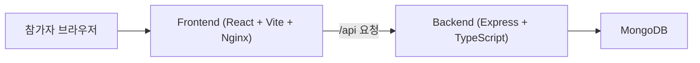

# 구조 및 스택

## 서비스 구조



- 프론트엔드는 React + Vite로 빌드되고, 배포 시에는 Nginx가 정적 파일을 서빙합니다.
- `/api/*` 요청은 Nginx가 백엔드로 프록시합니다.
- 백엔드는 Express + TypeScript + Mongoose 조합입니다.
- 데이터는 MongoDB에 저장됩니다.

## 주요 기술 스택

### Frontend

- React 19
- TypeScript
- Vite 7
- React Router 7
- Tailwind CSS 4
- DaisyUI 5
- Axios
- GSAP
- `qrcode.react`
- `xlsx`

### Backend

- Node.js 18
- Express 5
- TypeScript
- MongoDB
- Mongoose
- JWT
- bcryptjs

### Infra

- Docker
- Docker Compose
- Nginx
- GitHub Actions
- Docker Hub
- Certbot

## 폴더 구조

```text
.
├── docs
├── docker-compose.yml
├── docker-compose.quickstart.yml
├── .env.example
├── unicon-vote-backend
│   ├── Dockerfile
│   ├── .env_template
│   └── src
└── unicon-vote-frontend
    ├── Dockerfile
    ├── .env_template
    ├── nginx.conf
    ├── nginx.http.conf
    └── src
```

## 핵심 인증 흐름

### 1. QR 접속

- 모든 팔찌 QR은 `/login?uuid=<UUID>` 주소를 가리킵니다.
- 프론트 로그인 페이지는 백엔드의 `GET /api/auth/status/:uuid`를 먼저 호출합니다.

### 2. 상태 확인 결과

- 해당 UUID 사용자가 없으면 에러를 보여줍니다.
- 비밀번호가 없으면 `isFirstAccess=true`로 판단하고 `/signup?uuid=...`로 보냅니다.
- 비밀번호가 있으면 로그인 폼을 그대로 보여줍니다.

### 3. 회원가입

- `POST /api/auth/register`가 비밀번호를 저장합니다.
- `guest` 역할인 경우에만, 회원가입 시 전달된 이름으로 이름을 바꿀 수 있습니다.
- 서버에 이름이 이미 있는 계정은 회원가입 화면에서 이름 입력칸이 잠겨 있습니다.

### 4. 로그인

- `POST /api/auth/login`이 JWT를 발급합니다.
- 이후 보호된 페이지는 localStorage의 `authToken`으로 접근합니다.

## 관리자 관련 주요 API

- `GET /api/admin/users`
- `POST /api/admin/users`
- `PATCH /api/admin/users/:uuid`
- `PATCH /api/admin/users/:uuid/reset-password`
- `POST /api/admin/users/replace-bracelet`
- `DELETE /api/admin/users/:uuid`
- `GET /api/admin/users/stats`
- `GET /api/health`
- `POST /api/admin/uploads/game-thumbnail`
- `POST /api/admin/games`
- `PATCH /api/admin/games/:id`
- `GET /api/admin/votes/voter-count`
- `GET /api/admin/votes/results`
- `GET /api/admin/votes/by-user`

## 운영상 중요한 점

- 비밀번호 초기화는 `password` 필드를 제거하는 방식입니다.
- 따라서 초기화된 계정은 다음 QR 접속 시 다시 회원가입 화면으로 이동합니다.
- 여분 팔찌 교체는 대상 사용자의 `uuid`를 새 guest 팔찌의 `uuid`로 바꾸는 방식입니다.
- 교체가 완료되면 기존 QR은 더 이상 로그인에 쓸 수 없습니다.
- 초기 시딩은 관리자 계정을 기본으로 만들고, `SEED_SAMPLE_DATA=true`일 때만 샘플 사용자와 샘플 게임을 넣습니다.
